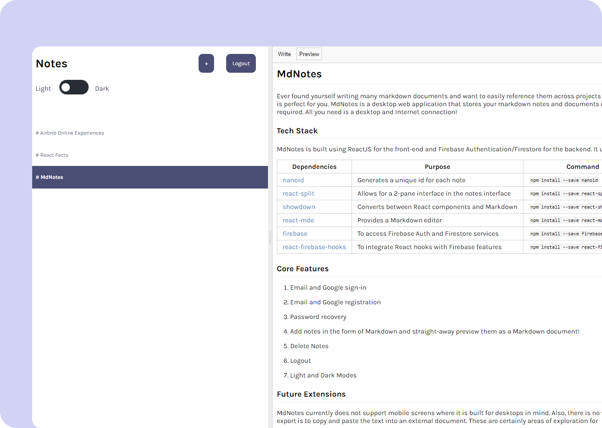

# MdNotes
Ever found yourself writing many markdown documents and want to easily reference them across projects (since remembering Markdown syntax could be difficult... 🥲 ) ? Well, MdNotes is perfect for you. MdNotes is a desktop web application that stores your markdown notes and documents on a cloud server, allowing you to easily cross-reference whenever required. All you need is a desktop and Internet connection!

You can use MdNotes [here](https://mdnotes-docs.netlify.app/) and access the Figma mockup [here](https://www.figma.com/file/V9vrHPMETXE0PbabuL5yrH/MdNotes?type=design&node-id=0%3A1&mode=design&t=1OgJ6dhfwajpH3K2-1).

    

### Tech Stack
MdNotes is built using ReactJS for the front-end and Firebase Authentication/Firestore for the backend. It is hosted using Netifly. It uses the following dependencies:

| Dependencies                                                               | Purpose                                              | Command                                   |
|----------------------------------------------------------------------------|------------------------------------------------------|-------------------------------------------|
| [nanoid](https://www.npmjs.com/package/nanoid)                             | Generates a unique id for each note                  | `npm install --save nanoid`               |
| [react-split](https://www.npmjs.com/package/react-split)                   | Allows for a 2-pane interface in the notes interface | `npm install --save react-split`          |
| [showdown](https://www.npmjs.com/package/react-showdown)                   | Converts between React components and Markdown       | `npm install --save react-showdown`       |
| [react-mde](https://www.npmjs.com/package/react-mde)                       | Provides a Markdown editor                           | `npm install --save react-mde`            |
| [firebase](https://www.npmjs.com/package/firebase)                         | To access Firebase Auth and Firestore services       | `npm install --save firebase`             |
| [react-firebase-hooks](https://www.npmjs.com/package/react-firebase-hooks) | To integrate React hooks with Firebase features      | `npm install --save react-firebase-hooks` |

### Core Features
1. Email and Google sign-in

    

2. Email and Google registration

    

3. Password recovery

    

4. Add notes in the form of Markdown and straight-away preview them as a Markdown document!

    

5. Delete Notes

    

6. Logout

    

7. Light and Dark Modes

    

### Future Extensions
MdNotes currently does not support mobile screens where it is built for desktops in mind. Also, there is no way of easily exporting a Markdown note where the current way for export is to copy and paste the text into an external document. These are certainly areas of exploration for MdNotes.

### Acknowledgements
This project was mainly an educational one, where the main intention was for me to gain exposure and hands-on experience with ReactJS. It would not have been possible without the help from the following sources:
1. [Bob Ziroll's Learn React course on scrimba](https://scrimba.com/learn/learnreact)

This course taught me the basics of React, such as React states, effects, forms and conditional rendering. MdNotes was in fact an extension from one of the hands-on project taught in the course. I would highly recommend this course as Bob is very patient and meticulous in teaching, constantly encouraging students to try out the in-course challenges instead of just watching the course videos.

2. [Yusuff Faruq's article on how to integrate Firebase auth with React applications](https://blog.logrocket.com/user-authentication-firebase-react-apps/)

This is a well-written article with clear explanation on how to set up Firebase authentication services in a React application. I used it to set up the auth services, and integrated it with my Firestore database.